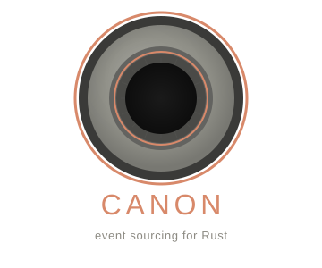

<p align="center"></p>

# Canon

**Vibe-Coded Macro-driven event sourcing for Rust.**

Canon is a framework for building event-sourced services in Rust. It provides an opinionated,
production-ready pipeline from command handling through guaranteed event delivery to projected
read models — with zero boilerplate.

Canon is an experiment to find the limits of vibe coding. Can an entire enterprise-ready event sourcing framework be AI generated from first principles?

- **Proc-macro driven** — define aggregates, commands, events, and handlers with attribute macros. Canon generates all trait implementations and dispatch logic.
- **Guaranteed delivery** — events are staged in a YugabyteDB ACID transaction via the outbox pattern. No dual-write bugs, ever.
- **Pluggable infrastructure** — every concern sits behind a trait. Swap Cassandra for DynamoDB, Kafka for Pulsar. The core never changes.
- **Full pipeline** — inbox with idempotency, oversight gates, snapshotting, projections with rebuild, dead letter handling, cross-service routing, and counterfactual replay.
- **In-memory test harness** — integration tests run in milliseconds with zero external infrastructure.

## Quickstart

```rust
#[aggregate(snapshot_every = 50)]
pub struct Ship {
    status: ShipStatus,
    fuel_level: f32,
}

#[command(Ship, version = 1, produces = [ShipDeparted])]
pub struct DepartForStation { pub destination: StationId }

#[event(Ship, version = 1)]
pub struct ShipDeparted { pub destination: StationId }

#[event_combiner(Ship, version = 1)]
impl ShipDeparted {
    fn combine(&self, state: &mut Ship) {
        state.status = ShipStatus::InFlight;
    }
}

#[command_handler(Ship, version = 1)]
impl DepartForStationHandler {
    type Error = FleetError;
    fn handle(&self, state: &Ship, cmd: DepartForStation) -> Result<ShipDeparted, FleetError> {
        if state.status != ShipStatus::Docked { return Err(FleetError::NotDocked); }
        Ok(ShipDeparted { destination: cmd.destination })
    }
}

// ServiceBuilder auto-discovers everything via inventory
ServiceBuilder::new().for_aggregate::<Ship>().build()
```

## Links

- **[Documentation](https://canon.mopjones.com/docs)** — full user guide, macros reference, and internals
- **[Live Demo](https://canon.mopjones.com/demo)** — a spaceship logistics game powered entirely by Canon
- **[Landing Page](https://canon.mopjones.com)** — overview and features
- **[GitHub Issues](https://github.com/rjh-mopjones/canon/issues)** — bug reports and feature requests

## License

Apache 2.0

---

*Canon is an experiment in AI-assisted development — every line was written through human-AI collaboration using Claude Code.*
